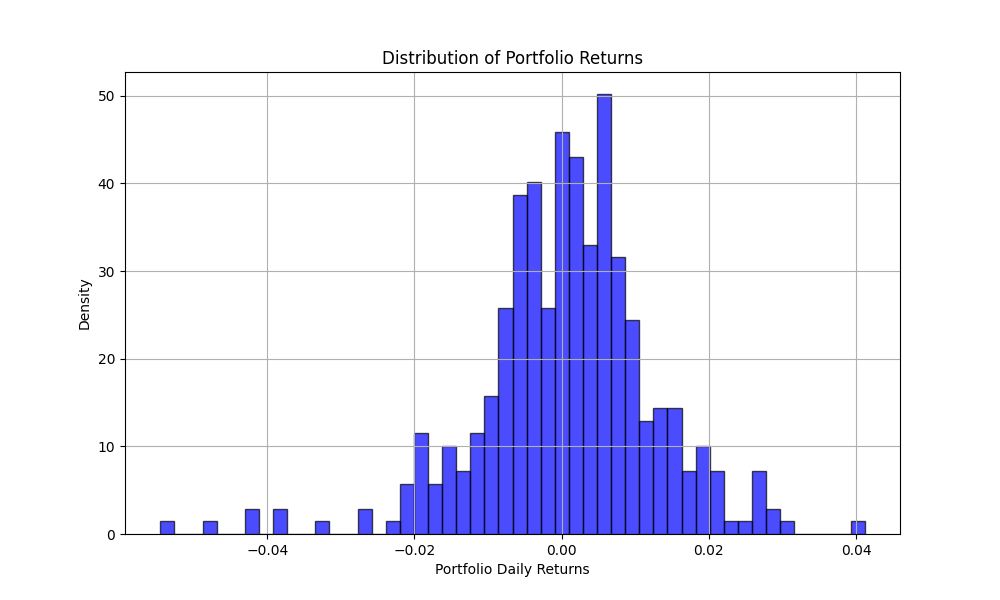

# Portfolio Analysis AI

This project demonstrates an interactive web application for analyzing portfolio data using natural language queries, powered by either OpenAI GPT or a local LLM.



## Features

- Interactive portfolio visualization with customizable date ranges
- Real-time portfolio statistics and correlation analysis
- Natural language querying powered by either:
  - OpenAI GPT-3.5
  - Local LLM (Ollama)
- Dynamic visualization generation based on queries
- Support for multiple visualization types (Plotly, Matplotlib)

## Tech Stack

- [Streamlit](https://streamlit.io/) - For building the interactive web interface
- [PandasAI](https://pandas-ai.com/) - For natural language to code generation
- Choice of LLM:
  - [OpenAI GPT-3.5](https://platform.openai.com/docs/api-reference) - Cloud-based LLM
  - [Ollama](https://ollama.ai/) - For running local LLM (qwen2.5-coder model)
- [Plotly](https://plotly.com/) - For interactive visualizations
- [Pandas](https://pandas.pydata.org/) - For data manipulation

## Prerequisites

1. For OpenAI:
   - Create a [new API key](https://platform.openai.com/account/api-keys)

2. For Local LLM:
   - Install [Ollama](https://ollama.ai/) on your system
   - Pull the qwen2.5-coder model:
   ```sh
   ollama pull qwen2.5-coder:32b
   ```

## Setup

1. Create a new Python environment:
```sh
python -m venv venv
source venv/bin/activate  # On Unix
.\venv\Scripts\activate   # On Windows
```

2. Install dependencies:
```sh
pip install -r requirements.txt
```

3. Choose your LLM:

   For OpenAI:
   ```bash
   # On Windows
   set OPENAI_API_KEY="sk-..."
   # On Unix
   export OPENAI_API_KEY="sk-..."
   ```

   For Local LLM:
   - Start Ollama server (should be running on http://localhost:11434)

4. Place your portfolio data in the `data` folder as `myport2.csv` with the following format:
   - Date column in YYYYMMDD format
   - Asset prices in columns

## Running the Application

For OpenAI version:
```sh
streamlit run streamlit_app.py
```

For Local LLM version:
```sh
streamlit run test4_visual.py
```

## Usage

1. Select your desired date range using the sidebar
2. View portfolio statistics in the "Portfolio Analysis" tab
3. Ask questions about your portfolio in natural language in the "AI Assistant" tab, such as:
   - "Calculate the Sharpe ratio for my portfolio"
   - "Show me the correlation between assets"
   - "Plot the rolling volatility"

## LLM Comparison

### OpenAI GPT-3.5
- Highly accurate responses
- Requires internet connection
- API costs apply
- Data sent to cloud

### Local LLM (Ollama)
- Enhanced privacy (all data stays local)
- No API costs
- Faster response times
- Offline capability
- May require more computational resources
